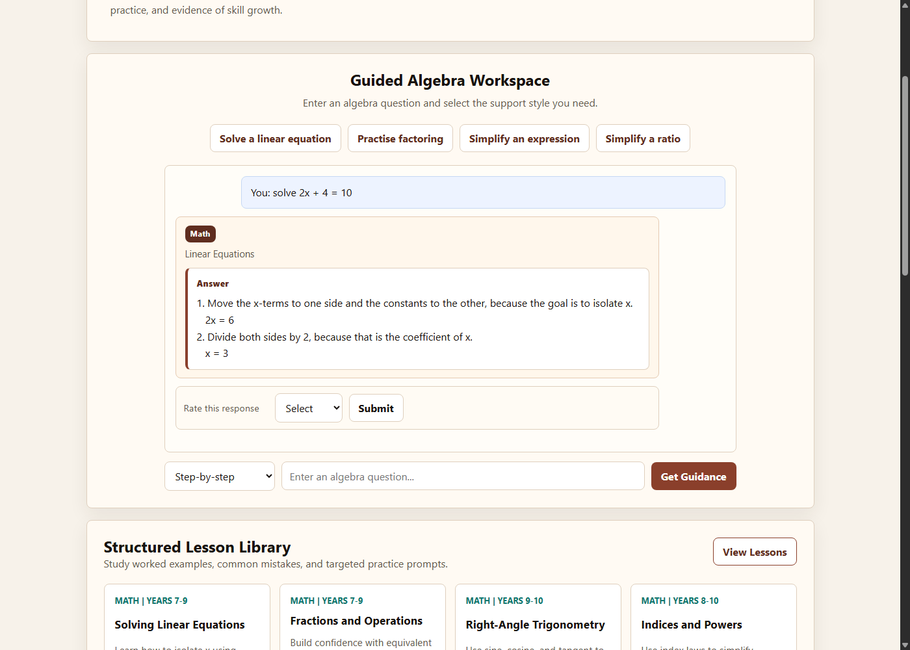
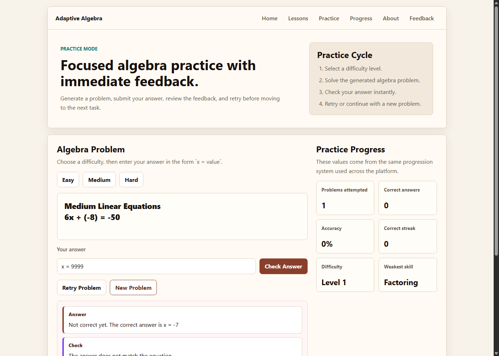
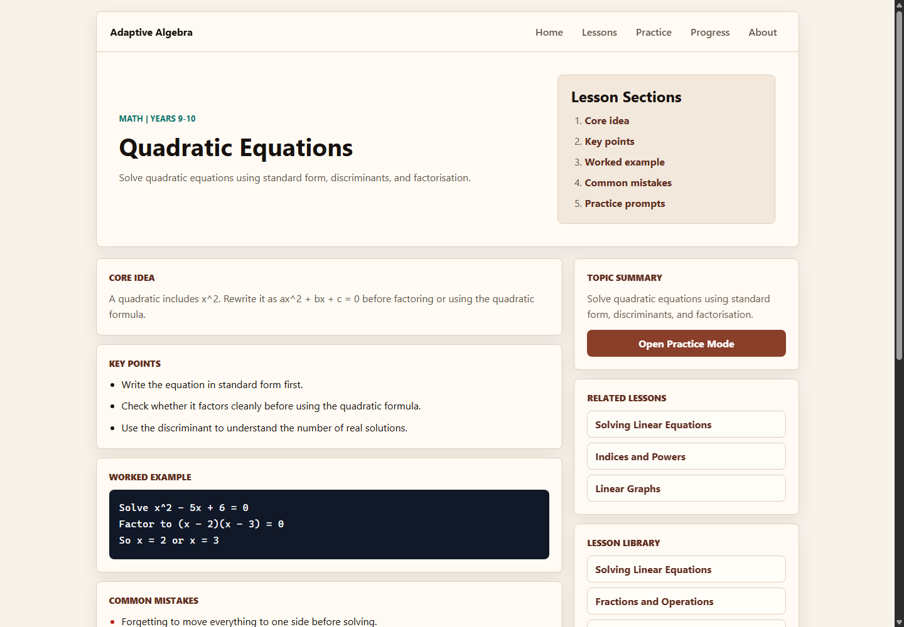
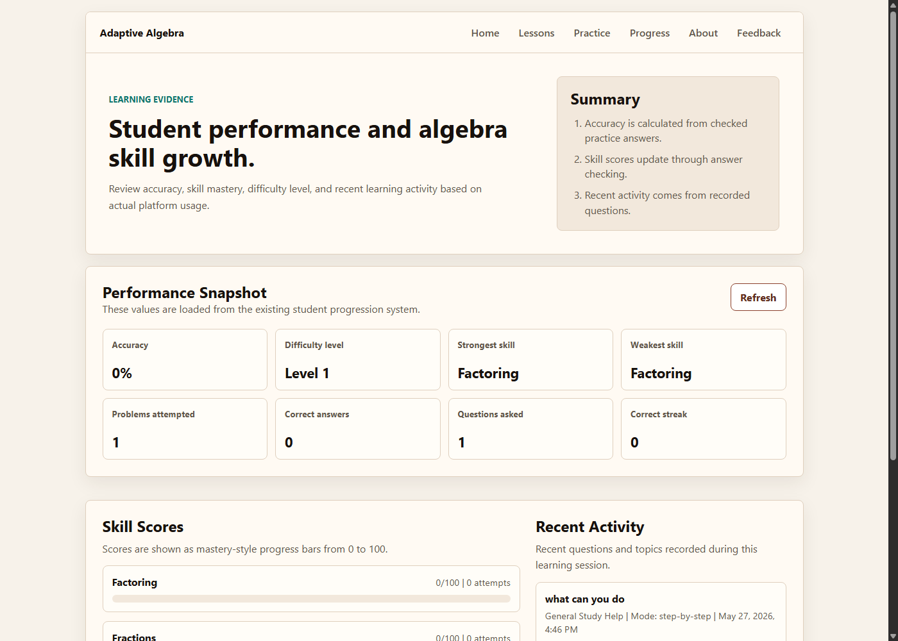
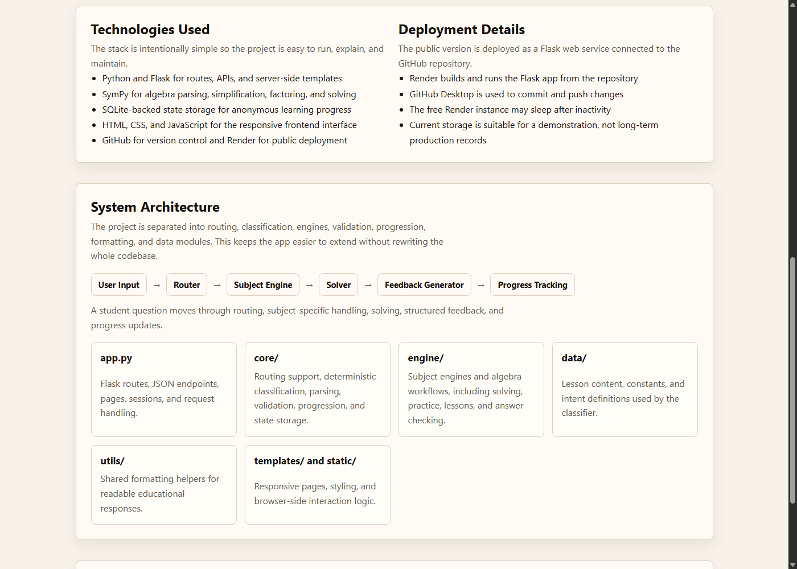
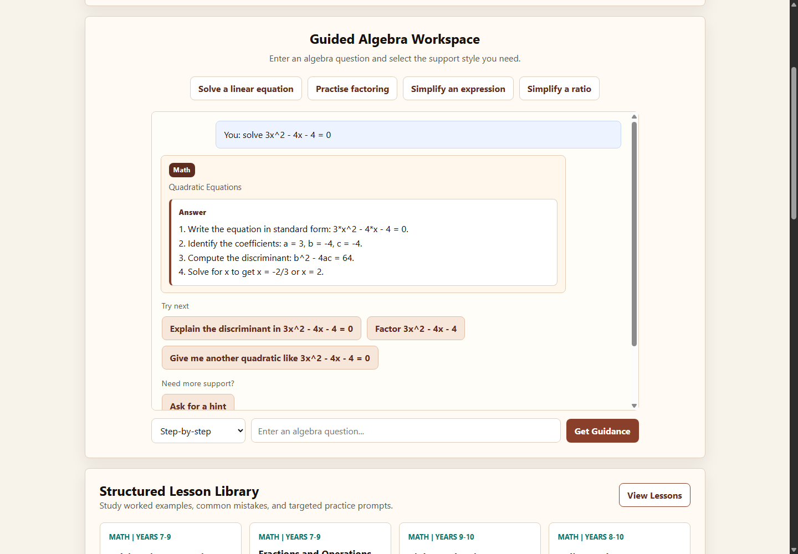
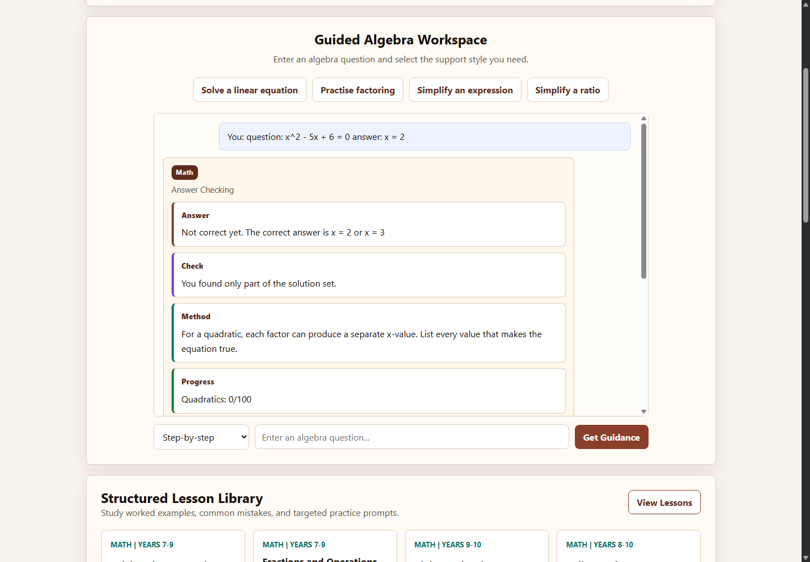
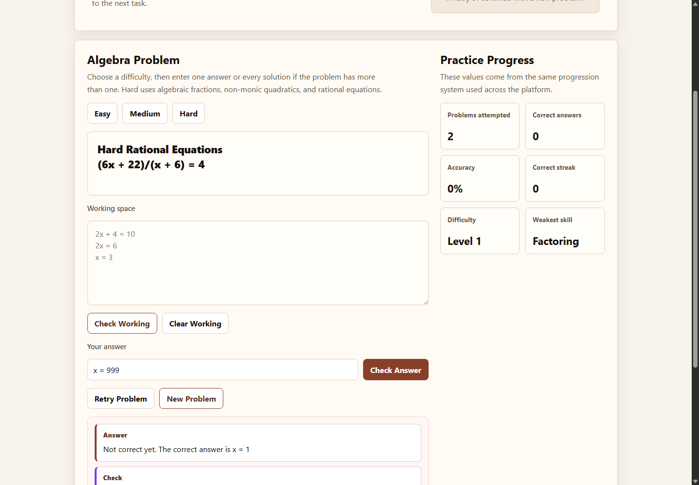

# Adaptive Algebra Learning Platform

A deployed Flask educational platform for guided algebra learning, structured
practice, answer checking, lessons, and progress tracking.

Public demo: https://ai-chatbot-project-tlou.onrender.com

Askademic AI is the project name used for the platform in portfolio and
application materials.

## Project Purpose

This project was built to support algebra revision, homework, and independent
practice. It focuses on helping students understand the method behind an
answer, not only receiving the final result.

The platform is strongest in algebra. It is not intended to replace a teacher
or compete with general-purpose AI systems. Its purpose is to provide a focused
learning environment for supported mathematics tasks.

## Development Journey

This project began as a simple web application designed to help students
practise and understand algebra through structured, step-by-step solutions.

Rather than remaining a basic equation solver, the platform has evolved through
continuous iteration based on teacher and student feedback. Over time, features
such as Hint Mode, Practice Mode, lesson pages, progress tracking, answer
validation, automated testing, and a modular backend architecture were
introduced to create a more complete learning experience.

Development follows an iterative engineering process: identify a problem, build
a solution, collect feedback, evaluate the results, and refine the platform.
Each version represents measurable improvements driven by real user testing
rather than simply adding new functionality.

## Project Philosophy

Askademic AI is built on the belief that educational technology should support
learning rather than replace it.

Instead of functioning as a general-purpose chatbot that immediately provides
answers, the platform is designed to encourage mathematical reasoning through
guided explanations, structured hints, targeted practice, and progressive
feedback.

The objective is to help students understand *why* a solution works, not simply
what the correct answer is.

Future development will continue to prioritise educational value, transparency,
and measurable learning outcomes over simply increasing the number of supported
mathematical topics or adding unnecessary features.

## Key Features

- Step-by-step algebra explanations
- Hint Mode for independent thinking before full support
- Direct answer mode for quick checking
- Practice Mode with generated algebra problems
- Answer checking with feedback for correct and incorrect answers
- Working-space validation for student steps
- Lesson pages with examples, common mistakes, and practice prompts
- Progress tracking with accuracy, difficulty, skill scores, and recent activity
- Lightweight session memory using Flask sessions and SQLite-backed state
- Rule-based misconception detection and adaptive practice recommendations
- Clean error handling for malformed equations and unsupported input

## Supported Algebra Areas

- Linear equations
- Quadratic equations
- Factoring
- Simplifying expressions
- Ratios
- Simultaneous equations
- Selected trigonometry-style algebra questions
- Generated practice problems at different difficulty levels

## Teacher Feedback

Teacher feedback indicated that the mathematical reasoning appeared accurate,
the algebraic methods were appropriate, and the step-by-step explanations were
clear and easy to follow.

The feedback also identified three useful directions for improvement:

- Add stronger feedback for common mistakes
- Add more visual representations, such as graphs
- Increase the variety of question difficulty

These points now guide the next development priorities for the project.

## Screenshots

| Section | Screenshot |
| --- | --- |
| Homepage |  |
| Solving Equations |  |
| Practice Mode |  |
| Lessons Page |  |
| Progress Dashboard |  |
| Architecture |  |

Additional demo screenshots:

- 
- 
- 

## Architecture

```text
User Input
  -> Router
  -> Subject Engine
  -> Solver
  -> Feedback Generator
  -> Progress Tracking
```

The project is separated into modules so the system is easier to maintain and
extend.

```text
app.py
  Flask routes, pages, JSON endpoints, sessions, and request handling

homework_helper.py
  Compatibility wrapper for older imports

core/
  Classification, parsing, validation, progression, session memory, and state

engine/
  Algebra solving, practice workflows, lessons, and subject handlers

data/
  Constants, lesson content, and intent definitions

utils/
  Shared formatting helpers

templates/ and static/
  Frontend pages, CSS, JavaScript, screenshots, and favicon
```

## Technologies Used

- Python 3.11
- Flask
- SymPy
- SQLite
- HTML, CSS, and JavaScript
- Gunicorn
- Render
- GitHub and GitHub Desktop

## Testing

The project includes regression tests for routing, algebra solving, answer
checking, progression, lessons, frontend routes, and parser edge cases.

Current local verification:

```powershell
python -m unittest discover -s tests
```

Latest test run:

```text
78 tests passed
```

## Setup

1. Clone the repository.

```powershell
git clone <your-repository-url>
cd ai_chatbot_project
```

2. Create and activate a virtual environment.

```powershell
python -m venv .venv
.\.venv\Scripts\Activate.ps1
```

3. Install dependencies.

```powershell
python -m pip install -r requirements.txt
```

4. Run tests.

```powershell
python -m unittest discover -s tests
```

5. Start the app locally.

```powershell
python app.py
```

Then open:

```text
http://127.0.0.1:5000
```

## Deployment

The project is deployed publicly on Render.

Render build command:

```text
pip install -r requirements.txt
```

Render start command:

```text
gunicorn app:app --bind 0.0.0.0:$PORT
```

The free Render instance may sleep after inactivity, so the first request after
a pause can take longer.

## Future Improvements

- Add graph visuals for linear and quadratic equations
- Improve common mistake detection and feedback
- Add more Year 10 and Year 11 style question generators
- Add teacher-facing summaries after the learning data model is more mature
- Move long-term learning data to a hosted production database if needed
- Add user accounts only if persistent individual progress becomes necessary

## Future Development

The long-term vision is to transform Askademic AI from an algebra tutoring
application into an adaptive mathematics learning platform that personalises
learning for individual students.

Planned and continuing educational improvements include:

- Adaptive misconception detection
- Personalised learning pathways
- Skill mastery tracking
- Adaptive practice recommendations
- Interactive mathematical visualisations
- Learning analytics dashboards
- Teacher dashboard and classroom insights
- Continued expansion of supported mathematics topics where educationally valuable

## Research Direction

Future development will investigate questions such as:

- Do adaptive hints improve student understanding?
- Which explanation styles are most effective for different learners?
- Can common algebra misconceptions be detected automatically?
- How should practice adapt based on a student's learning history?
- Which interventions best help students overcome persistent misconceptions?

Rather than making unsupported claims about educational effectiveness, future
versions of the platform will focus on collecting evidence through teacher
feedback, student testing, usage analytics, and iterative evaluation.

The long-term objective is to build an adaptive educational system that not
only solves mathematical problems, but also understands how students learn,
identifies where they struggle, and provides personalised support that evolves
alongside their progress.

Future improvements will continue to be guided by measurable educational impact,
sound software engineering practices, and continuous feedback from real users.
