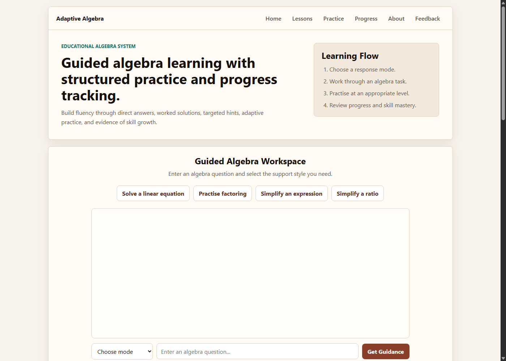

# Adaptive Algebra Learning Platform

A Flask-based educational platform for guided algebra learning, structured
practice, answer checking, lessons, and progress tracking.

Public demo: https://ai-chatbot-project-tlou.onrender.com

## Overview

This project began as a homework helper and has been refactored into a modular
algebra learning platform. It focuses on explainable educational behaviour:
students can ask algebra questions, receive structured responses, practise
generated problems, check answers, and review progress over time.

The system is strongest in algebra. It is not intended to replace a teacher or
cover every school subject in depth.

## Educational Purpose

The goal is to support active learning rather than only giving final answers.
Responses are designed to show:

- the answer
- the method
- why the method works
- how to check the result
- a sensible next step

The platform also records learning context such as recent questions, current
topic, active practice problem, current lesson, mistakes, difficulty level, and
skill progression.

## Features

- Deterministic math intent routing for requests such as `solve_linear`,
  `solve_quadratic`, `factor_expression`, `simplify_expression`,
  `solve_simultaneous`, `validate_steps`, `generate_hint`, and
  `generate_problem`.
- Algebra solving for linear equations, quadratic equations, factoring,
  simplifying expressions, simultaneous equations, ratios, and selected
  trigonometry-style algebra questions.
- Practice mode with generated problems, answer input, instant feedback, retry
  support, and progression updates.
- Lesson pages with summaries, core ideas, key points, worked examples, common
  mistakes, and practice prompts.
- Progress page showing accuracy, skill scores, strongest and weakest skills,
  difficulty level, and recent activity.
- Lightweight session memory using a Flask session ID plus SQLite-backed
  learning state.
- Clean educational error messages for malformed equations, parser failures,
  empty input, and unsupported operations.

## Architecture

### Learning Flow

```text
User Input
  -> Router
  -> Subject Engine
  -> Solver
  -> Feedback Generator
  -> Progress Tracking
```

The router decides which part of the system should handle the request. The
subject engine runs the relevant learning workflow, the solver handles supported
algebra operations, the feedback generator formats the response clearly, and
progress tracking records activity for the student dashboard.

```text
app.py
  Flask routes, request validation, pages, APIs, and anonymous session IDs

homework_helper.py
  Compatibility wrapper for older imports

core/
  classification, parsing, validation, progression, session memory, and state

engine/
  algebra solving, practice workflows, lesson logic, and subject engines

data/
  constants, lesson content, and intent definitions

utils/
  shared response formatting helpers

templates/ and static/
  frontend pages, CSS, JavaScript, and favicon
```

Learning state is stored in SQLite under `instance/homework_helper.sqlite3` by
default. Flask sessions store only a small anonymous user ID and lightweight
browser-session context.

## Technologies Used

- Python 3.11
- Flask
- SymPy
- SQLite
- HTML, CSS, and JavaScript
- Gunicorn
- Render
- GitHub / GitHub Desktop

## Screenshots

Use a consistent browser size, light theme, and clean sample algebra questions.
Save final screenshots in:

```text
static/screenshots/
```

Recommended screenshot set:

| Section | Placeholder file | What the screenshot should show |
| --- | --- | --- |
| Homepage | `static/screenshots/homepage.png` | Project title, overview, main input area, quick actions, and dashboard panel. |
| Solving Equations | `static/screenshots/solving-equations.png` | A solved algebra question with answer, method, why, check, and next step sections. |
| Practice Mode | `static/screenshots/practice-mode.png` | Generated problem, answer field, feedback message, retry controls, and practice stats. |
| Lessons Page | `static/screenshots/lessons-page.png` | A lesson topic with summary, core idea, key points, worked example, and practice prompts. |
| Dashboard | `static/screenshots/dashboard.png` | Accuracy, skill scores, strongest and weakest skill, difficulty, and recent activity. |
| Deployment | `static/screenshots/deployment.png` | Render service page or public deployed site URL showing the project is live. |
| Architecture | `static/screenshots/architecture.png` | About page architecture flow from user input to progress tracking. |

After adding the files, use Markdown image links like:

```markdown

```

Avoid screenshots with personal information, browser notifications, unrelated
tabs, debug logs, or empty loading states.

## Setup Instructions

1. Clone the repository.

```powershell
git clone <your-repository-url>
cd ai_chatbot_project
```

2. Create and activate a virtual environment.

```powershell
python -m venv .venv
.\.venv\Scripts\Activate.ps1
```

3. Install dependencies.

```powershell
python -m pip install -r requirements.txt
```

4. Run tests.

```powershell
python -m unittest discover -s tests
```

5. Start the Flask app locally.

```powershell
python app.py
```

Then open:

```text
http://127.0.0.1:5000
```

## Deployment

The project is deployed on Render as a Flask web service.

Render build command:

```text
pip install -r requirements.txt
```

Render start command:

```text
gunicorn app:app --bind 0.0.0.0:$PORT
```

The free Render instance may sleep after inactivity, so the first request after
a pause can take longer.

## Future Improvements

- Add user accounts only if long-term individual progress is needed.
- Move production learning data to a hosted database.
- Expand algebra coverage with more problem generators.
- Add teacher-facing summaries after the student data model is stable.
- Add screenshots and a short demo video for presentation.
- Continue increasing tests around parser edge cases and intent routing.
